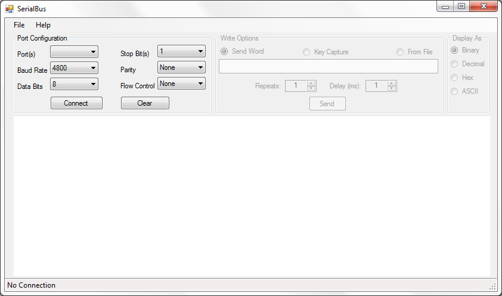

# Features and Screen shots

## User interface
* Auto-detect available COM ports
* Display outgoing data in blue and incoming data in green

## Connection options
* Supports Baud Rate: 4800, 9600, 19200, 38400, 57600, 115200
* Supports Data Bits: 5, 6, 7 and 8
* Supports Stop Bits: 1, 1.5 and 2
* Supports Parity: None, Odd, Even, Mark, Space
* Supports Flow Control: None, RTS, RTS/X, Xon/Xoff

## Receive options
* Receive data instantly

## Transmit options
* Transmit words and sentences in ASCII format
* Transmit at every key press
* Transmit ASCII characters from a file
